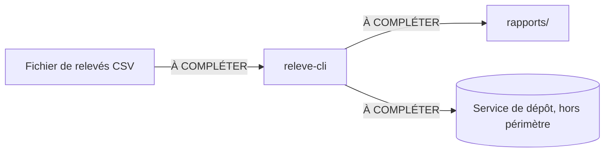

# Architecture de releve-cli

> Dernière révision : À COMPLÉTER (date du jour)
> Rédaction : À COMPLÉTER — Relecture : À COMPLÉTER

## Ce que ce document décrit

Une vue d'ensemble de releve-cli, l'outil en ligne de commande de l'Atelier Logiciel
Nantais : quels éléments le composent, ce qui circule entre eux, et par quel moyen.
Ce document ne décrit pas le code source ligne à ligne, ni le service de dépôt distant.

## Hors périmètre

À COMPLÉTER — citer explicitement ce qui n'est pas maintenu par l'atelier.

## Vue d'ensemble

Deux écritures sont acceptées. Gardez celle que vous préférez, supprimez l'autre.

### Écriture 1 — schéma en caractères

```
+---------------------+        <étiquette du flux>        +-----------------+
|  Fichier de relevés | -------------------------------> |  releve-cli     |
|  (CSV horodaté)     |                                   |  (lecture+calcul)|
+---------------------+                                   +-----------------+
                                                                    |
                                      À COMPLÉTER : moyen, sens, contenu
                                                                    v
                                                          +-----------------+
                                                          |  À COMPLÉTER    |
                                                          +-----------------+

Légende : [ ] élément du projet   ->  flux sortant   ( ) élément hors périmètre
```

### Écriture 2 — bloc Mermaid



## Tableau des éléments

| Élément | Rôle | Remplaçable par | Contrainte connue |
|---|---|---|---|
| Fichier de relevés (CSV) | À COMPLÉTER | À COMPLÉTER | Une mesure par ligne, séparateur virgule |
| releve-cli | À COMPLÉTER | À COMPLÉTER | Lit tout le fichier en mémoire |
| Dossier rapports/ | À COMPLÉTER | À COMPLÉTER | À COMPLÉTER |
| Service de dépôt | À COMPLÉTER | — | Hors périmètre de l'atelier |

## Liste de contrôle avant de proposer ce fichier

- [ ] Chaque bloc porte un nom que l'on retrouve dans le code et dans les échanges.
- [ ] Chaque flèche porte une étiquette : moyen, sens, contenu.
- [ ] La légende explique les formes et les traits employés.
- [ ] Le périmètre exclu est écrit explicitement.
- [ ] La date de dernière révision est renseignée.
- [ ] Aucune marque `À COMPLÉTER` ne subsiste.
