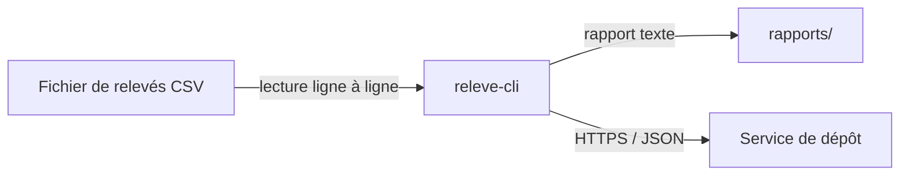

# Architecture de releve-cli

> Dernière révision : 6 octobre 2026
> Rédaction : LEMOINE Benjamin — Relecture : POYET Maxime

## Ce que ce document décrit

Une vue d'ensemble de releve-cli, l'outil en ligne de commande de l'Atelier Logiciel
Nantais : quels éléments le composent, ce qui circule entre eux, et par quel moyen.
Ce document ne décrit pas le code source ligne à ligne, ni le service de dépôt distant.

## Hors périmètre

Le service de dépôt des rapports : il est hébergé hors de l'atelier, qui ne le maintient pas.
Seul le flux qui y mène est représenté. La production du fichier de relevés CSV n'est pas
couverte non plus : le schéma part du fichier déjà présent sur le poste.

## Vue d'ensemble

Deux écritures sont acceptées. Gardez celle que vous préférez, supprimez l'autre.

### Écriture 1 — schéma en caractères

```
+----------------------+
|  Fichier de relevés  |
|  (CSV horodaté)      |
+----------------------+
           |
           |  lecture ligne à ligne
           v
+----------------------+
|  releve-cli          |
|  (lecture + calcul)  |
+----------------------+
      |          |
      |          |  HTTPS, sortant :
      |          |  rapport en JSON
      |          v
      |    (--------------------)
      |    (  Service de dépôt  )
      |    (  hors périmètre    )
      |    (--------------------)
      |
      |  écriture fichier :
      |  rapport texte tabulaire
      v
+----------------------+
|  rapports/           |
+----------------------+

Légende : [ ] élément du projet
          ->  flux sortant
          ( ) élément hors périmètre
```

### Écriture 2 — bloc Mermaid



## Tableau des éléments

| Élément | Rôle | Remplaçable par | Contrainte connue |
|---|---|---|---|
| Fichier de relevés (CSV) | ADAM Jérémie | AUNE Amaury | Une mesure par ligne, séparateur virgule |
| releve-cli | POYET Maxime | LEMOINE Benjamin | Lit tout le fichier en mémoire |
| Dossier rapports/ | AUNE Amaury | ADAM Jérémie | releve-cli |
| Service de dépôt | LEMOINE Benjamin | un membre de l'équipe | Hors périmètre de l'atelier |
